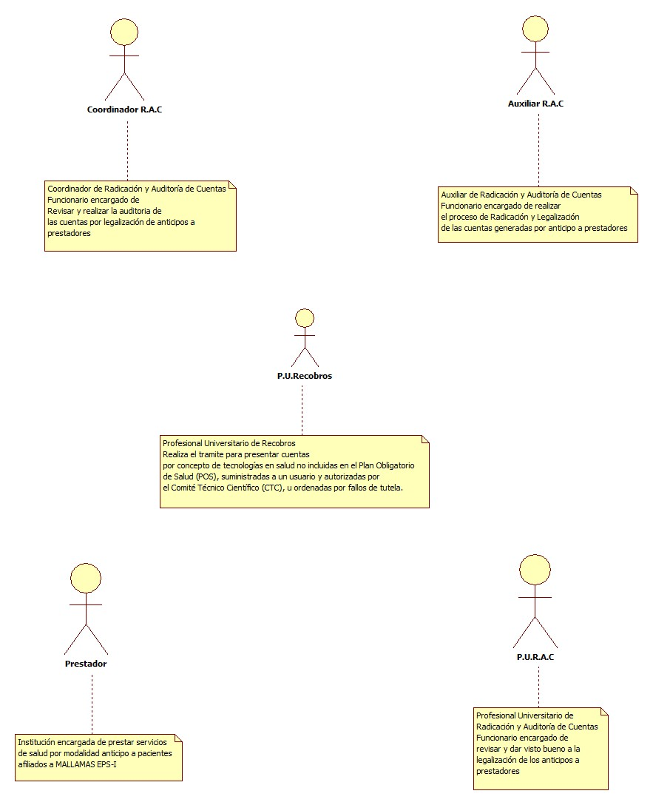
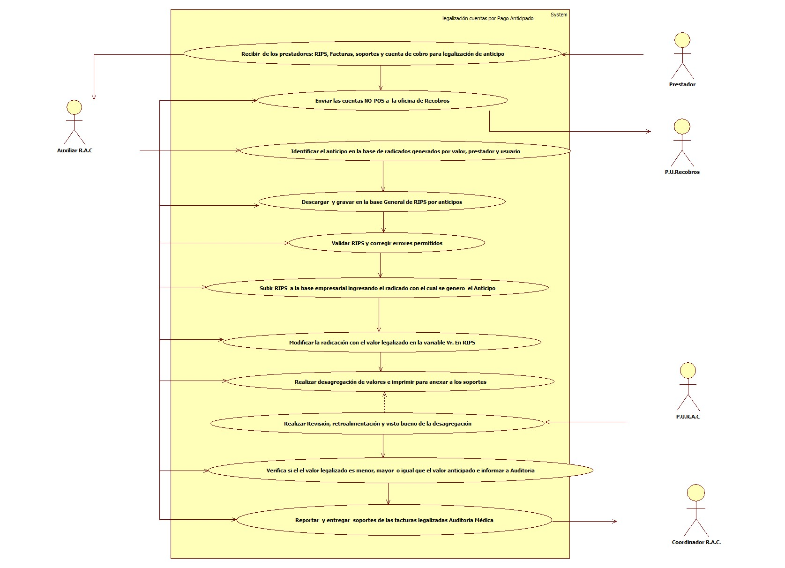
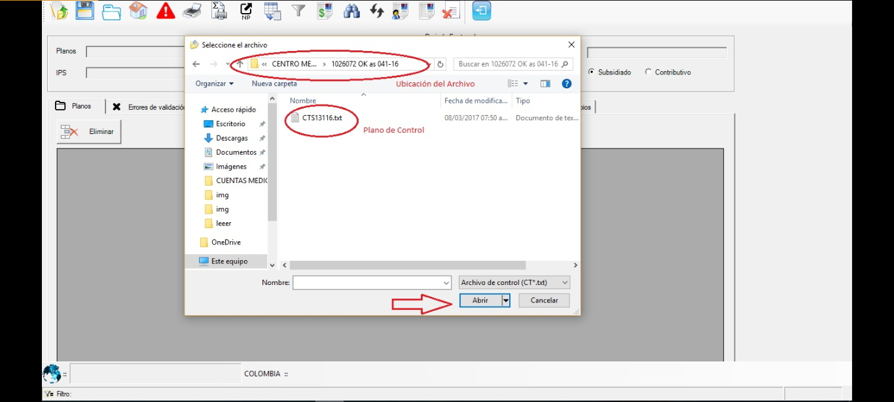
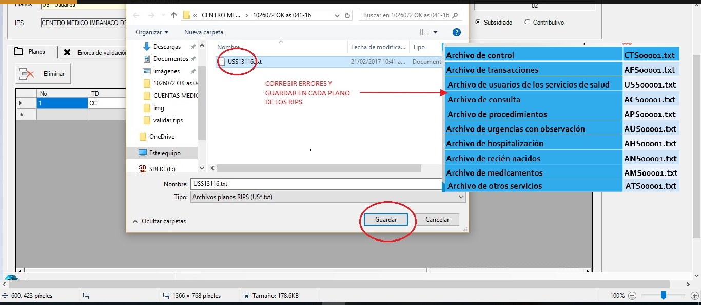
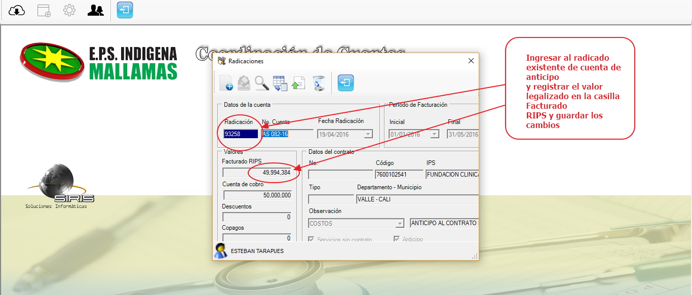
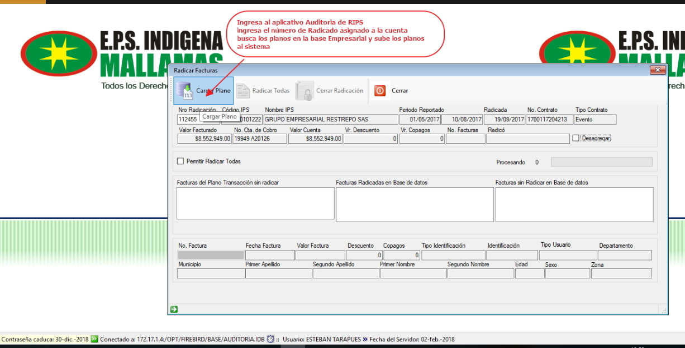
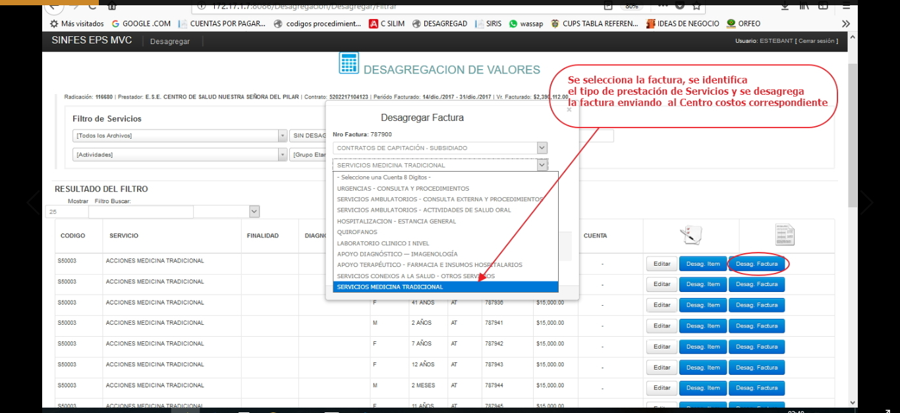
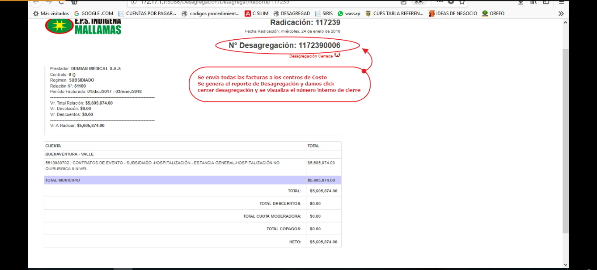

# SISTEMA DE INFORMACIÓN LEGALIZACIÓN DE CUENTAS POR PAGO ANTICIPADO

Sistema de información encargado de Generar, controlar y Legalizar los anticipos girados a los prestadores por concepto de prestación de servicios de salud.  

## 1. MODELADO DEL SISTEMA DE INFORMACIÓN

### 1.1 ACTORES LEGALIZACIÓN DE CUENTAS POR PAGO ANTICIPADO

### 1.2 IDENTIFICACIÓN DE LOS CASOS DE USO LEGALIZACIÓN DE CUENTAS POR PAGO ANTICIPADO

| Número | Procesos del Sistema Legalización de Cuentas por pago anticipado|
| ------ | ----------------------------------- |
| 1  |Recibir  de los prestadores: RIPS, Facturas, soportes y cuenta de cobro para legalización de anticipo      |
| 2  |Enviar las cuentas NO-POS a  la oficina de Recobros|
| 3  |Identificar el anticipo en la base de radicados generados por valor, prestador y usuario |
| 4  |Descargar  y gravar en la base General de RIPS por anticipos |
| 5  |Validar RIPS y corregir errores permitidos |
| 6  |Subir RIPS  a la base empresarial ingresando el radicado con el cual se genero  el Anticipo |
| 7  |Modificar la radicación con el valor legalizado en la variable Vr. En RIPS |
| 8  |Realizar desagregación de valores e imprimir para anexar a los soportes|
| 9  |Realizar Revisión, retroalimentación y visto bueno de la desagregación|
| 10 |Verifica si el el valor legalizado es menor, mayor  o igual que el valor anticipado e informar a Auditoria
| 11 |Reportar  y entregar  soportes de las facturas legalizadas Auditoria Médica|

### 1.3 DESCRIPCIÓN DEL DIAGRAMA DE CASOS DE USO LEGALIZACIÓN DE CUENTAS POR PAGO ANTICIPADO

| | | 
| - | - |
| **1. Caso de Uso** | Legalización de Cuentas por pago anticipado|
| **2. Descripción** |Procedimiento encargado de Generar, controlar y Legalizar los anticipos girados a los prestadores por concepto de prestación de servicios de salud.|
| **3. Actor(es)**| Auxiliar de radicación y Auditoria de Cuentas Medicas,Profesional Universitario de Radicación y Auditoria de Cuentas, Coordinador de Radicación y Auditoria de Cuentas, Prestador,Profesional Universitario de Recobros|
| **4. Pre Condiciones** |[Radicación de cuenta por pago anticipado](cuentaspagoanticipado.md)
| **5. Pos Condiciones** | Anticipo Legalizado |
| **6. Flujo de Eventos** |
| *Actor(es)* | *Sistema* |
|1. El auxiliar de radicación y Auditoria de Cuentas Medicas recibe de los prestadores: RIPS, Facturas, soportes y cuenta de cobro para legalización de anticipo desagregado por eventos POSS y NO-POS  |    |
|2. El auxiliar de radicación y Auditoria de Cuentas Medicas enviá cuentas NO-POS a la coordinación de cartera (recobros) para su tramite pertinente |   |
|3. El auxiliar de radicación y Auditoria de Cuentas Medicas Realiza  la identificación del anticipo confrontando el valor,usuario,prestador,fecha de procedimiento en la base de anticipos radicados|  |
|4. El auxiliar de radicación y Auditoria de Cuentas Medicas Auxiliar de radicación descarga  y grava en la base General de RIPS e ingresa a Validador accediendo a la opción validar nuevo|5. Presenta pantalla con archivo de control CT y demás generando listado de errores por cada plano de acuerdo a la normatividad|
|6. El Auxiliar de radicación corrige errores  que se permitan en los planos  y da clik en guardar|7. Guarda la corrección y elimina los errores|   
|8. El auxiliar de radicación y Auditoria de Cuentas Medicas  realiza el proceso de almacenamiento en el aplicativo Auditoria de RIPS ingresando el radicado del anticipo y dando clik en guardar |9.  presenta pantalla enviar y guardar |
|10. El auxiliar de radicación y Auditoria de Cuentas Medicas diligencia en la matriz de anticipos los datos relacionados con valor legalizado, fecha de envío, No de factura o relación,fecha entrega a auditoria |  |
|11. El auxiliar de radicación y Auditoria de Cuentas Medicas ingresar al aplicativo cuentas por pagar y modifica el valor en la radicación con el valor legalizado en la variable Vr. En RIPS|12. presenta pantalla con registro de datos de la radicación anticipo|
|13. El auxiliar de radicación y Auditoria de Cuentas Medicas ingresa al aplicativo y realiza desagregación de valores por el total del valor legalizado |14. presenta pantalla desagregar valores por factura, item  |
|15. El auxiliar de radicación y Auditoria de Cuentas Medicas genera reporte de desagregación y dar clik opción imprimir|16. presenta pantalla de informe desagregación de valores|
|17. El Profesional Universitario  de radicación y Auditoria de Cuentas Medicas hace la Revisión, retroalimentación y visto bueno de la desagregación    |  |
|18. El auxiliar de radicación y Auditoria de Cuentas Medicas  verifica si el El valor legalizado es menor, mayor  o igual que el valor anticipado  e informar a la coordinación de Auditoría de Cuentas medicas |  |
|19. El auxiliar de radicación y Auditoria de Cuentas Medicas registra en la matriz de anticipos los valores legalizados |    |
|20. El auxiliar de radicación y Auditoria de Cuentas Medicas realiza reporte  y entrega de soportes de las facturas legalizadas Auditoria Médica para continuar proceso  de Auditoria de cuentas anticipadas |    |
| **7. Requerimiento Asociado** | R001, R002, R003 |
|**8. Interfaz de Usuario Asociada** | I001, I002, I003, I004, I005  |
|**9. Formato de Usuario Asociado** | F001 |

### 1.4 MODELADO VISUAL DE LOS CASOS DE USO LEGALIZACIÓN DE CUENTAS POR PAGO ANTICIPADO

## 2. ESPECIFICACIÓN DEL SISTEMA DE INFORMACIÓN

| Término | Descripción |
| ------- | ----------- |
| Legalización| Corresponde al reconocimiento contable  y la presentación de documentos que soportan los servicios de salud mediante modalidad pago Anticipado   |
| Anticipo | Adelantos efectuados en dinero  por la Entidad con el fin de recibir  contraprestación futura de Servicios de Salud de acuerdo con las condiciones pactadas     |
| RIPS     | Registro Individual del Prestación de Servicios de Salud      |
|Auxiliar R.A.C.|Auxiliar de radicación y Auditoria de Cuentas|
|P.U.R.A.C  |Profesional Universitario de Radicación y Auditoria de Cuentas|
|Coordinador R.A.C.|Coordinador de Radicación y Auditoria de Cuentas|
|Recobros       | Procedimiento que se adelanta para presentar cuentas por concepto de tecnologías en salud no incluidas en el Plan Obligatorio de Salud (POS), suministradas a un usuario y autorizadas por el Comité Técnico Científico (CTC), u ordenadas por fallos de tutela.|
|P.U.Recobros  |Profesional Universitario de Recobros|

## 3. ESPECIFICACIÓN DE REQUERIMIENTOS

| | | |
| - | - | - |
| **N°** | **Tipo** | **Descripción** |
|R001| físico |Factura de Servicios|
|R002| físico |Historia Clínica|
|R003| físico |Autorización de Servicios|

## 4. ESPECIFICACIÓN DE LA INTERFACE DE USUARIO
| |
| - |
| **1. Número** |
| I001 |
| **2. Propósito de la Interfaz** |
| Abrir  planos y validar|
| **3. Gráfica de la Interfaz**|
|  |

| |
| - |
| **1. Número** |
| I002 |
| **2. Propósito de la Interfaz** |
| Corregir errores y guardar en cada plano |
| **3. Gráfica de la Interfaz**|
|  |

| |
| - |
| **1. Número** |
| I003 |
| **2. Propósito de la Interfaz** |
| Registrar valor legalizado|
| **3. Gráfica de la Interfaz**|
|  |

| |
| - |
| **1. Número** |
| I004 |
| **2. Propósito de la Interfaz** |
| Guardar RIPS en la Base Empresarial|
| **3. Gráfica de la Interfaz**|
|  |

| |
| - |
| **1. Número** |
| I005 |
| **2. Propósito de la Interfaz** |
| Desagregar por centros de costos|
| **3. Gráfica de la Interfaz**|
|  |

| |
| - |
| **1. Número** |
| I006 |
| **2. Propósito de la Interfaz** |
| Generar desagregación|
| **3. Gráfica de la Interfaz**|
|  |

### 4.1 IDENTIFICACIÓN DE PERFILES Y DIÁLOGOS

| |
| - |
| **1. Nombre del Perfil** |
| Administrador sistema  Legalización de cuentas por Pago Anticipado
| **2. Opciones a las que tiene Acceso**|
| Radicación |
| **3. Tipo de Acceso** |
| Registrar, recibir, imprimir informes|

### 4.2 ESPECIFICACIÓN DE FORMATOS DE USUARIO 
| Número | Nombre del formato|
| ------ | ----------------------- |
| F001     |Matriz de Anticipos     |