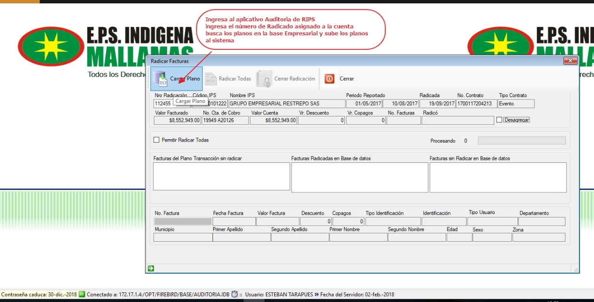
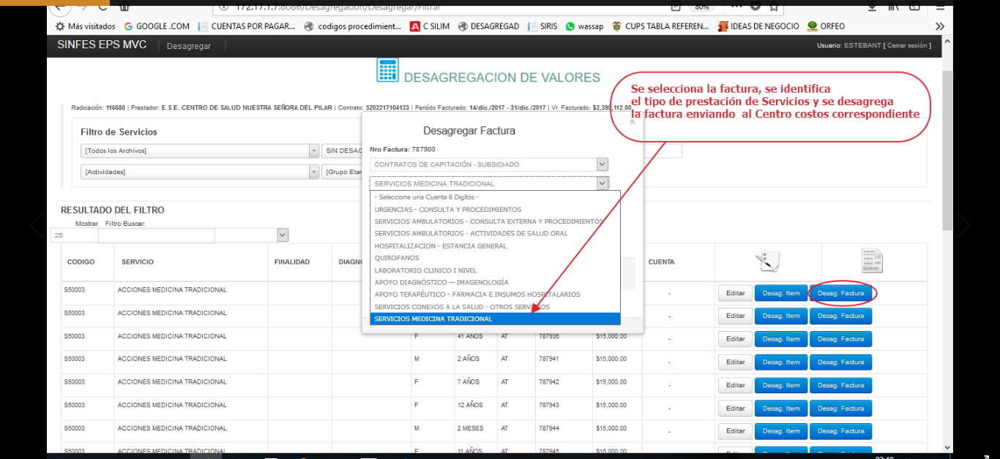
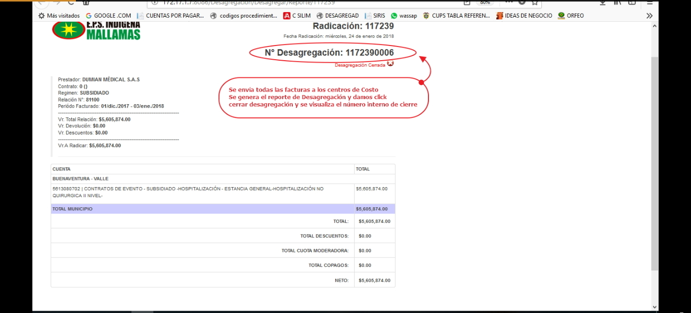

# SISTEMA DE INFORMACIÓN RADICACIÓN DE CUENTAS MEDICAS

Sistema de información encargado de Registro, validación, radicación y desagregación y cierre de las facturas presentadas por los prestadores por concepto de servicios de salud de los pacientes afiliados a Mallamas EPS-I

## 1. MODELADO DEL SISTEMA DE INFORMACIÓN

### 1.1 ACTORES RADICACION CUENTAS EVENTO

### 1.2 IDENTIFICACIÓN DE LOS CASOS DE USO RADICACIÓN CUENTAS EVENTO

| Número | Procesos del Sistema de Información |
| ------ | ----------------------------------- |
| 1      | Asignar fecha de entrega            |
| 2      | Diligenciar la matriz  cuentas        |
| 3      | Entrega relación de facturas y RIPS validados |
| 4      | Validar  RIPS       |
| 5      | Verificar  datos de  RIPS con Relación de facturas |
| 6      | Homologar usuarios en aplicativo validador RIPS    |
| 7      | Realizar el cruce y generar reporte de afiliados NO BASE  |
| 8      | Radicar facturas en el aplicativo Cuentas por pagar y generar Radicado |
| 9      | Diligenciar el numero de radicado en la matriz |
| 10     | Cargar al sistema  los planos en modulo Auditoria de RIPS |
| 11     | Realizar el Cruce  facturas aplicativo auditoria de RIPS|
| 12     | Generar  informe facturas duplicadas |
| 13     |Marcar las facturas para devolución       |
| 14     | Generar acta de devolución Entregar al  Prestador para respectiva firma   |
| 15     |Realizar recepción de facturas aceptadas  |
| 16     | Entregar  recibido registrando fecha y hora|
| 17     | Realizar proceso  Desagregación de valores y cierre |

### 1.3 DESCRIPCIÓN DEL DIAGRAMA DE CASOS DE USO RADICACIÓN CUENTAS EVENTO

| | |
| - | - |
| **1. Caso de Uso** | Radicación de cuentas evento |
| **2. Descripción** | Realizar proceso de radicación de cuentas evento de la Red de prestadores |
| **3. Actor(es)**   | Auxiliar de Radicación,Prestadores |
| **4. Pre Condiciones** | Rips validados y aceptados |
| **5. Pos Condiciones** | Cuenta radicada en el sistema|
| **6. Flujo de Eventos** |
| *Actor(es)* | *Sistema* |
| 1. Auxiliar de radicación asigna cita a prestador segun cronograma|  |
| 2. El prestador entrega  Relación de Facturas y RIPS validados en la fecha acordada |  |
| 3. Auxiliar de radicación Diligencia la  matriz de recepción de cuentas, ingresa al modulo validador de RIPS y la opción nueva validación|4. Genera pantalla para buscar el archivo de control y visualizar los demás planos|
|5. Auxiliar de radicación  verifica en el validador los datos de los RIPS: periodo radicado, valor facturado,prestador y verifica la correspondencia de datos con los soportes|
|6.  Auxiliar de radicación ingresa a al Icono Homologar  usuarios NO BASE |7. Presenta pantalla Homologar usuarios,nueva validación con las opciones de buscar en el plano de control y hacer el cruce inicial|
|8. Auxiliar de radicación ingresa nueva validación,busca el archivo de control  da clik en cruce inicial|9.  Hace el cruce y genera reporte de afiliados NO BASE|
|10. Auxiliar de radicación selecciona el tipo de dato del afiliado para hacer el cruce y da la opción cruzar, verifica si se encuentra activo,y da clik en el icono homologar  de acuerdo a la Base General de Afiliados |11. Guarda los usuarios homologados y genera  informe final de usuarios NO BASE|
|12. Auxiliar de radicación guarda reporte para realizar proceso de devolución de facturas|   |
|13. Auxiliar de radicación valida usuario y contraseña para ingreso modulo de Cuentas por pagar  y nueva radicación | 14. Generar formulario nueva radicación|
|15. Auxiliar de radicación ingresa datos de Relación de facturas, busca prestador, Periodo facturado, valor facturado y Numero  de contrato  registra y actualiza   |16.  Genera Numero de radicación interno para identificar la cuenta |   
|17. Auxiliar de radicación Diligencia el numero de radicado en la  matriz de recepción de cuentas||
| 18. Auxiliar de radicación  valida usuario y contraseña para ingreso modulo de Auditoria de RIPS  y ingresa opción radicar facturas sin desagregar| 19. Presenta pantalla cargar plano |
| 20. Auxiliar radicación busca los archivos y los carga al sistema |21. Genera pantalla de radicar todas y cerrar radicación|
| 22 . Auxiliar de radicación valida usuario y contraseña para ingreso modulo Auditoria de Cuentas Medicas | 23. Presenta pantalla de cruce de facturas |
|24. Auxiliar de radicación ingresa numero de radicado y da clik en cruzar facturas|25.  Genera informe de facturas duplicadas en el sistema|
| 26. Auxiliar de radicación  guarda informe para proceso de devolución|   |
| 27. Auxiliar de radicación ingresa al menu de devoluciones y marca las facturas para devolución según hallazgos encontrados de acuerdo a normatividad| 28 . Guarda y Genera acta de devolución|
|29. Auxiliar de radicación imprime acta de devolución  y entrega a Prestador para respectiva firma|  |
|30. Auxiliar de radicación Realiza recepción de facturas aceptadas una por  una, cruzando información del plano transacciones con documento físico|  |
|31. Auxiliar de radicación Acepta y Sella por recibido registrando fecha y hora , nombre de quien recibe y hora de aceptación en la Relación de facturas y en la matriz de recepción de cuentas |    |
|32. Auxiliar de radicación y Auditoria de Cuentas ingresa  aplicativo Desagregación e ingresa No de radicado y da clik en desagregar  |33. Presenta pantalla desagregar valores por factura, item.|
|34. Auxiliar de radicación y Auditoria y  desagrega factura por factura, enviando las facturas  a los centros de costos definidos de acuerdo Plan Único de cuentas y da clik en enviar item| 35. Guarda y actualiza el reporte de desagregación|
|36. Auxiliar de radicación y Auditoria completa el proceso de desagregación y da clik en generar reporte| 37. Presenta reporte de desagregación|
|38. Auxiliar de radicación y Auditoria revisa los datos y valores del formulario y da clik icono  cerrar desagregación| 39. Presenta informe de desagregación cerrada y genera un Numero de Identificación de cierre|
| **7. Requerimiento Asociado** | R001, R002, R003
| **8. Interfaz de Usuario Asociada** | I001,I002,I003,I004,I005,I006,I007,I008,I009,I010,I011,I012,I013,I014,I015,I016. |
| **9. Formato de Usuario Asociado** | F001 |

### 1.4 MODELADO VISUAL DEL CASO DE USO RADICACIÓN CUENTAS DE EVENTO

## 2. ESPECIFICACIÓN DEL SISTEMA DE INFORMACIÓN RADICACIÓN CUENTAS DE EVENTO
| Término | Descripción |
| ------- | ----------- |
| RIPS | Registro Individual prestador de Servicios de Salud             |
| MATRIZ |Conjunto de datos ordenados en filas y columnas              |

## 3. ESPECIFICACIÓN DE REQUERIMIENTOS

| | | |
| - | - | - |
| **N°** | **Tipo** | **Descripción** |
| R001 | <Físico/Proceso> | Contratos  |
| R002 | <Físico/Proceso> | Facturas |
| R003 |<Físico/Proceso>| RIPS |

## 4. ESPECIFICACIÓN DE LA INTERFACE DE USUARIO

| |
| - |
| **1. Número** |
| I001 |
| **2. Propósito de la Interfaz** |
| Validadación de Rips |
| **3. Gráfica de la Interfaz**|
|  |

| |
| - |
| **1. Número** |
| I002 |
| **2. Propósito de la Interfaz** |
| Cargar Rips para validación |
| **3. Gráfica de la Interfaz**|
|  |

| |
| - |
| **1. Número** |
| I003 |
| **2. Propósito de la Interfaz** |
| Verificar datos de RIPS |
| **3. Gráfica de la Interfaz**|
|  |

| |
| - |
| **1. Número** |
| I004 |
| **2. Propósito de la Interfaz** |
| Cargar Archivos para Homologación de Usuarios |
| **3. Gráfica de la Interfaz**|
|  |

| |
| - |
| **1. Número** |
| I005 |
| **2. Propósito de la Interfaz** |
| Homologación de Usuarios|
| **3. Gráfica de la Interfaz**|
|  |

| |
| - |
| **1. Número** |
| I006 |
| **2. Propósito de la Interfaz** |
| Radiación de cuenta |
| **3. Gráfica de la Interfaz**|
|  |

| |
| - |
| **1. Número** |
| I007 |
| **2. Propósito de la Interfaz** |
| Generación de radicado |
| **3. Gráfica de la Interfaz**|
|  |

| |
| - |
| **1. Número** |
| I008 |
| **2. Propósito de la Interfaz** |
| Cargar RIPS al sistema de Información |
| **3. Gráfica de la Interfaz**|
|  |

| |
| - |
| **1. Número** |
| I009 |
| **2. Propósito de la Interfaz** |
| Buscar Archivo y guardar |
| **3. Gráfica de la Interfaz**|
| 

| |
| - |
| **1. Número** |
| I010 |
| **2. Propósito de la Interfaz** |
| Modulo Cruce de Facturas |
| **3. Gráfica de la Interfaz**|
| 

| |
| - |
| **1. Número** |
| I011 |
| **2. Propósito de la Interfaz** |
| Cruce de facturas duplicadas |
| **3. Gráfica de la Interfaz**|
| 

| |
| - |
| **1. Número** |
| I012 |
| **2. Propósito de la Interfaz** |
| Devolución de Facturas con inconsistencias|
| **3. Gráfica de la Interfaz**|
| 

| |
| - |
| **1. Número** |
| I013 |
| **2. Propósito de la Interfaz** |
| Generar Acta de Devolución |
| **3. Gráfica de la Interfaz**|
| 

| |
| - |
| **1. Número** |
| I014 |
| **2. Propósito de la Interfaz** |
| Ingresar con el radicado al aplicativo Desagregación de Valores |
| **3. Gráfica de la Interfaz**|
| |

| |
| - |
| **1. Número** |
| I015 |
| **2. Propósito de la Interfaz** |
| Desagregar las facturas por Centros de Costo |
| **3. Gráfica de la Interfaz**|
| |

| |
| - |
| **1. Número** |
| I016 |
| **2. Propósito de la Interfaz** |
| Generar Desagregación de Valores  y cerrar Radicación|
| **3. Gráfica de la Interfaz**|
| |
### 4.1 IDENTIFICACIÓN DE PERFILES Y DIÁLOGOS

| |
| - |
| **1. Nombre del Perfil** |
| Administrador del sistema de radicación y Auditoria de cuentas |
| **2. Opciones a las que tiene Acceso**|
| Radicación de Cuentas Medicas|
| **3. Tipo de Acceso** |
| Registrar, recibir,imprimir informes, radicar,validar,desagregar |

### 4.2 ESPECIFICACIÓN DE FORMATOS DE USUARIO

| Número | Nombre del Formato |
| ------ | ----------------------------------- |
| F001   | Matriz de Registro de cuentas Radicadas         
