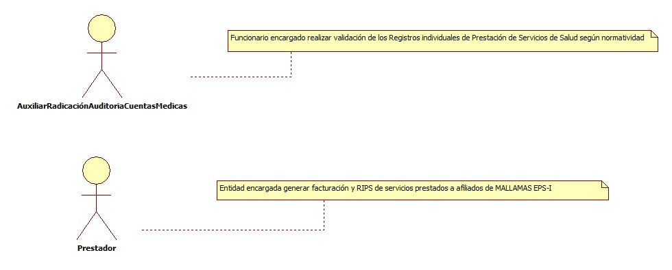
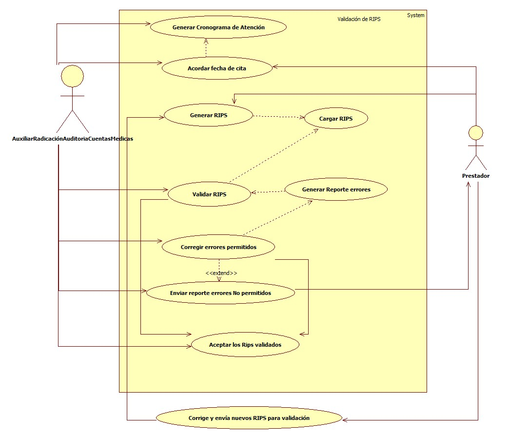
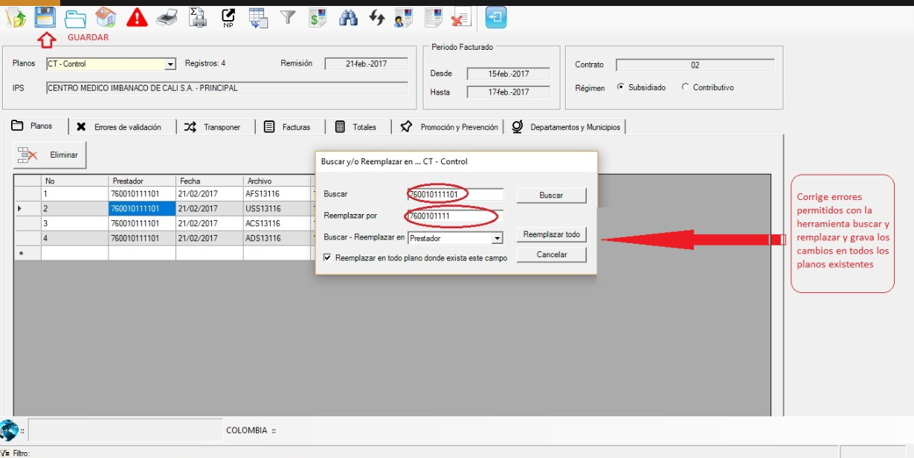
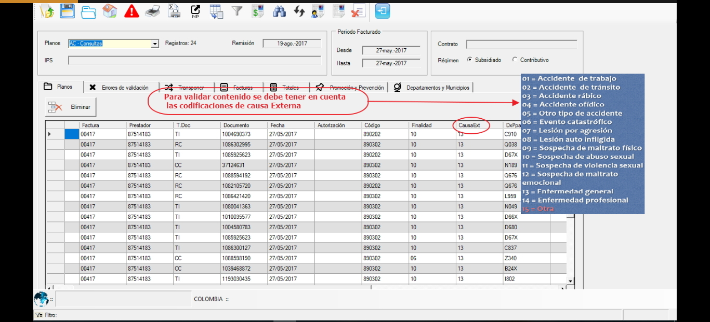

# SISTEMA DE INFORMACIÓN RADICACIÓN DE CUENTAS MEDICAS

Sistema de información encargado de Registro, validación, radicación y desagregación y cierre de las facturas presentadas por los prestadores por concepto de servicios de salud de los pacientes afiliados a Mallamas EPS.I

## 1. MODELADO DEL SISTEMA DE INFORMACIÓN

### 1.1 ACTORES VALIDACIÓN DE RIPS

### 1.2 IDENTIFICACIÓN DE LOS CASOS DE USO VALIDAR RIPS 
| Número | Procesos del Sistema Validación de RIPS|
| ------ | ----------------------------------- |
| 1  |Generar cronograma de atención      |
| 2  |Acordar fecha de cita|
| 3  |Generar RIPS   |
| 4  |Cargar RIPS    |
| 5  |Validar RIPS    |
| 6  |Generar reporte de errores    |
| 7  |Corregir errores permitidos    |
| 8 |Enviar reporte errores No permitidos|
| 9  |Aceptar los Rips validados   |
| 10  |Corrige y envía nuevos RIPS para validación   |

### 1.3 DESCRIPCIÓN DEL DIAGRAMA DE CASOS DE USO VALIDACIÓN DE RIPS

| | |
| - | - |
| **1. Caso de Uso** |  validación de RIPS|
| **2. Descripción** | Procedimiento en el cual se  realiza  Validación de RIPS de la facturación  emitida por los prestadores de salud  modalidad evento de  usuarios de Mallamas EPS-I |
| **3. Actor(es)**| Auxiliar de Radicación,Prestador|
| **4. Pre Condiciones** |RIPS enviados por parte del prestador
| **5. Pos Condiciones** | RIPS validados de acuerdo a normatividad|
| **6. Flujo de Eventos** |
| *Actor(es)* | *Sistema* |
| 1. Auxiliar de radicación comunica al prestador el periodo Radicación   y recepción de facturas  de acuerdo al cronograma mensual|  |
|2. El prestador y el Auxiliar de Radicación acuerdan la fecha de recepción de la facturación|  |
|3. El prestador Genera Rips y enviá por correo electrónico para validación |  |
|4. Auxiliar de radicación descarga  y grava en la base General de RIPS e ingresa a Validador accediendo a la opción validar nuevo|5. Ingresa a la pantalla abrir Rips
| 6. El Auxiliar radicación Ingresa  a pantalla nueva validación|7. carga archivo CT y demás  generando listado de errores por cada plano de acuerdo a la normatividad|
|8. El Auxiliar de radicación corrige errores  que se permitan en los planos  y da clik en guardar|9. Guarda la corrección y elimina los errores|  
| |10. Genera reporte de errores que no se pueden corregir|
|11. El Auxiliar Radicación guarda el reporte y enviá por correo electrónico al prestador|
|12. El prestador repite el paso 3|  |
|13. El Auxiliar radicación repite el paso 4,5,6 Y 7|  |
|14. El Auxiliar de radicación revisa correcciones |
|15. El Auxiliar de radicación acepta los Rips validados notificando al prestador por correo electrónico | |
| **7. Requerimiento Asociado** | Ninguno |
|**8. Interfaz de Usuario Asociada** | I001, I002 ,I003,I004,I005,I006  |
|**9. Formato de Usuario Asociado** | F001 |

### 1.4 MODELADO VISUAL DE LOS CASOS DE USO

## 2. ESPECIFICACIÓN DEL SISTEMA DE INFORMACIÓN

| Término | Descripción |
| ------- | ----------- |
| RIPS | Registro individual de prestación de servicios salud              |

## 3. ESPECIFICACIÓN DE REQUERIMIENTOS

| | | |
| - | - | - |
| **N°** | **Tipo** | **Descripción** |
|  |  |  |

## 4. ESPECIFICACIÓN DE LA INTERFACE DE USUARIO
| |
| - |
| **1. Número** |
| I001 |
| **2. Propósito de la Interfaz** |
| validación de RIPS|
| **3. Gráfica de la Interfaz**|
|  |

| |
| - |
| **1. Número** |
| I002 |
| **2. Propósito de la Interfaz** |
| Buscar archivo para validación|
| **3. Gráfica de la Interfaz**|
|  |

| |
| - |
| **1. Número** |
| I003 |
| **2. Propósito de la Interfaz** |
| Presenta reporte de errores de validación|
| **3. Gráfica de la Interfaz**|
|  |

| |
| - |
| **1. Número** |
| I004 |
| **2. Propósito de la Interfaz** |
| validación causa externa|
| **3. Gráfica de la Interfaz**|
|  |

| |
| - |
| **1. Número** |
| I005 |
| **2. Propósito de la Interfaz** |
| validación finalidades|
| **3. Gráfica de la Interfaz**|
|  |

| |
| - |
| **1. Número** |
| I006 |
| **2. Propósito de la Interfaz** |
| corrige y elimina errores permitidos  y guarda los cambios efectuados |
| **3. Gráfica de la Interfaz**|
|  |

### 4.1 IDENTIFICACIÓN DE PERFILES Y DIÁLOGOS

| |
| - |
| **1. Nombre del Perfil** |
| Administrador sistema  radicación y Auditoria de cuentas Medicas|
| **2. Opciones a las que tiene Acceso**|
| Auxiliar de Radicación|
| **3. Tipo de Acceso** |
| Registrar, recibir,imprimir informes radicar,validar,desagregar |

### 4.2 ESPECIFICACIÓN DE FORMATOS DE USUARIO 
| Número | Nombre del formato|
| ------ | ----------------------- |
| F001     |Registro diario de Cuentas Recibidas     |